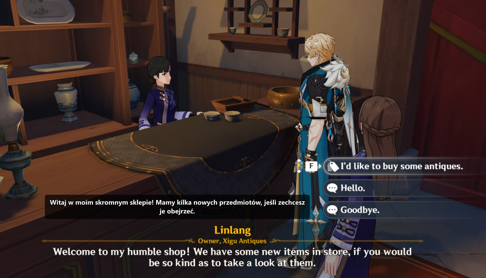

# Kaption — real-time in-game subtitle translation

[](https://github.com/wojciechowskiapp/Kaption/actions/workflows/ci.yml)
[](https://github.com/wojciechowskiapp/Kaption/actions/workflows/codeql.yml)
[](https://kaption.one)
[](https://kaption.one/#download)
[](https://deepwiki.com/wojciechowskiapp/Kaption)
[](./LICENSE)

Kaption translates the dialogue in Hoyoverse games — **Genshin Impact** and **Honkai: Star Rail** — into your language in real time, on Windows. Everything runs locally on your machine: no streaming, no cloud OCR.

> 📥 **Get it for free at [kaption.one](https://kaption.one/#download)**



*Above: NPC name card, dialogue line, and answer options — all translated to Polish over the original English game UI.*

---

## What you get

- **Smart OCR overlay.** Reads the dialogue from your game window with GPU-accelerated screen capture and a 3-stage matcher (SymSpell → n-gram → OCR-confusion-weighted Levenshtein). Typos and rendering noise don't break recognition.
- **Anchored, clean translations.** The overlay sits above the dialogue box, sized to the line, in a card that doesn't get in the way of gameplay.
- **NPC + answer translation.** Optional cards translate the NPC name, the line, and your three response options.
- **Auto-setup.** Region selection, first-run wizard, per-game profiles. You launch it and it figures out where your game's dialogue lives.
- **Zero install hassle.** The installer bundles the .NET 10 runtime. Velopack handles updates after that.
- **Latency: ~80 ms** from "text appears on screen" to "translation shows up". You don't notice it during play.

## Supported games

Genshin Impact and Honkai: Star Rail are tuned out of the box. The primary translation target is **Polish**. Other language pairs work whenever a translation pack exists; new locales can be added on the backend without a client update.

## Get it

End users: head to **[kaption.one/#download](https://kaption.one/#download)**. That's the official installer; Velopack takes care of updates from there. Nothing else to install — the .NET 10 Desktop runtime ships in the bundle.

System requirements:

- Windows 10 version 2004 or later, 64-bit.
- 64-bit CPU with AVX (PaddleOCR needs it).
- A DirectX 12 / DirectML GPU is strongly preferred — recognition is under 10 ms there. The CPU path runs at 40–80 ms per frame, which is still fine.
- About 500 MB of disk for translation packs.

## What this repo is

This is the **full source of the Kaption desktop client**, published source-available under AGPL-3.0 + Commercial dual licence. You can browse it, audit it, build it. The backend, landing site, and translation pipeline are separate services and stay private.

For an AI-assisted tour of the codebase, **[ask DeepWiki](https://deepwiki.com/wojciechowskiapp/Kaption)**.

## Building from source

Prerequisites:

- **.NET 10 SDK 10.0.203 or newer** ([dotnet.microsoft.com/download](https://dotnet.microsoft.com/download)).
- **Windows 10 or newer.** The desktop project targets `net10.0-windows`; building on Linux or macOS won't produce a usable binary.

```
dotnet build GI-Subtitles/GI-Subtitles.csproj -c Debug
dotnet test  GI-Test/GI-Test.csproj            -c Debug
```

Expected: 188 tests pass, 2 pre-existing data-dependent fails (`DialoguePredictionTests`), 5 external-data skips.

For a self-contained Release build that bundles the runtime (the shape end users get from the official installer):

```
dotnet publish GI-Subtitles/GI-Subtitles.csproj ^
    -c Release -r win-x64 --self-contained true
```

Output lands under `GI-Subtitles/bin/Release/net10.0-windows/win-x64/publish/`.

Configuration is per-user at `%APPDATA%\Kaption\Config.json`. Every key is documented in [`docs/CONFIG.md`](./docs/CONFIG.md).

## How file protection works

Translation packs use AES-256 with HMAC-SHA256 authentication, PBKDF2-stretched keys derived from a per-device 32-byte secret. The secret is issued by Kaption's backend the first time you launch the app, then mixed with your local machine fingerprint. A `.gisub` pulled off one machine cannot be decrypted on another, and **nothing in this source tree is a usable key on its own**. The secret is fetched once on first launch (you'll see a brief "Preparing translations…" dialog), then cached DPAPI-wrapped on disk.

Full crypto details are in [`.github/SECURITY.md`](./.github/SECURITY.md).

## Project layout

- `GI-Subtitles/` — the WPF app: OCR pipeline, matcher, overlay rendering, settings UI, licensing, networking.
- `PaddleOCRSharp/` — ONNX-Runtime wrapper around PaddleOCR.
- `Screenshot/` — screen capture (DXGI default, GDI fallback) and the region-selection UI.
- `GI-Test/` — MSTest coverage for matching, OCR primitives, dialogue prediction, and the security stack.

## Contributing

Bug reports, translation additions, and focused PRs are welcome. The full flow is in [`.github/CONTRIBUTING.md`](./.github/CONTRIBUTING.md).

Security issues: see [`.github/SECURITY.md`](./.github/SECURITY.md). Please don't open public issues for anything exploitable.

## Licence and trademarks

- **Code:** dual-licensed under [AGPL-3.0](./LICENSE-AGPL) and a [commercial option](./LICENSE-COMMERCIAL). The top-level [`LICENSE`](./LICENSE) explains which option applies to which use.
- **Trademarks:** "Kaption" and the Kaption logo are trademarks of Michał Wojciechowski. The source licence does not grant trademark rights. If you fork and redistribute, ship under a different name and icon. See [`docs/TRADEMARKS.md`](./docs/TRADEMARKS.md).
- **Privacy:** [`docs/PRIVACY.md`](./docs/PRIVACY.md) is the source-repo summary; the authoritative policy is at [kaption.one/privacy](https://kaption.one/privacy).
- **Bundled third-party software:** [`THIRD_PARTY_LICENSES.txt`](./THIRD_PARTY_LICENSES.txt).

## Acknowledgements

Kaption started as a fork of [`qew21/Genshin-Subtitles`](https://github.com/qew21/Genshin-Subtitles) (Apache-2.0), the first OCR + TextMap overlay for Hoyoverse games. We've since rewritten the pipeline, matcher, networking, licensing, and UI, but the core idea (read dialogue off the screen with OCR, look it up in the game's TextMap, draw the translation over the top) started there. Thanks, qew21.

Thanks also to **[Dimbreath](https://www.patreon.com/c/dimbreath/posts)**, who maintains the community game-data repositories every dialogue line Kaption recognises gets matched against: [AnimeGameData](https://github.com/DimbreathBot/AnimeGameData) for Genshin and [turnbasedgamedata](https://gitlab.com/Dimbreath/turnbasedgamedata) for HSR. Nothing downstream of OCR works without those repos staying current with each patch. There's a longer public note at [kaption.one/credits](https://kaption.one/credits); if Dimbreath's work has ever helped you, support them directly.

Also built on PaddleOCR, ONNX Runtime, Velopack, Sentry, Lucene.Net, and OpenCV. Hoyoverse owns the game text we match against; translation packs are licensed compilations published for personal in-game use.

---

Made at **[kaption.one](https://kaption.one)**.
