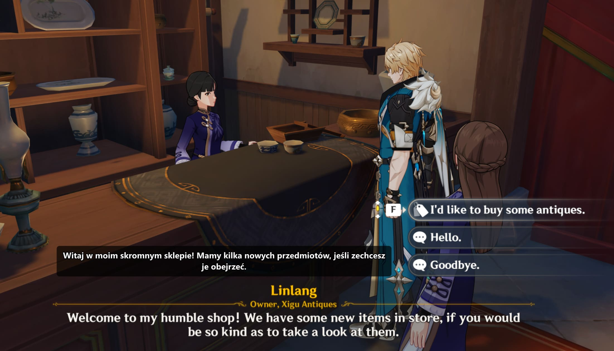

# Kaption

[](https://github.com/wojciechowskiapp/Kaption/actions/workflows/ci.yml)
[](https://github.com/wojciechowskiapp/Kaption/actions/workflows/codeql.yml)
[](https://deepwiki.com/wojciechowskiapp/Kaption)
[](./LICENSE)

Real-time subtitle translation for Hoyoverse games on Windows. Kaption reads the dialogue box off your screen and draws a translated subtitle over the game. It does not modify game files, inject code, or read game memory.

Everything after the download runs locally — screen capture, OCR, and matching all happen on your machine.

**[Download for Windows](https://kaption.one/#download)** · [kaption.one](https://kaption.one)



## Supported games

| Game | Status |
|---|---|
| Genshin Impact | Supported |
| Honkai: Star Rail | Supported |
| Zenless Zone Zero | Supported since 2.2.0 |

Polish is the current translation target. Other languages work as soon as a translation pack exists — adding one is a backend change, not a client release.

## How it works

1. Capture the screen region where the game draws dialogue (DXGI, GDI fallback).
2. Run OCR on it (PaddleOCR via ONNX Runtime, GPU with a CPU fallback).
3. Match the recognised text against the game's dialogue data, in three stages: SymSpell → n-gram candidates → Levenshtein weighted by common OCR confusions (`l`↔`1`, `O`↔`0`). OCR noise rarely breaks the match.
4. Draw the translation in an overlay above the dialogue box.

End to end this takes about 80 ms, and the overlay is excluded from screen capture so it never reads itself.

Speaker names are separated from the dialogue line per game: Genshin and Star Rail print them in an accent colour, ZZZ prints them in plain white, so ZZZ uses layout geometry instead.

## Requirements

- Windows 10 2004 or later, 64-bit
- A CPU with AVX (required by PaddleOCR)
- A DirectX 12 / DirectML GPU is recommended — recognition runs under 10 ms there, versus 40–80 ms on CPU
- ~500 MB of disk for translation packs

The installer bundles the .NET 10 runtime, so there is nothing else to install. Updates are handled by Velopack.

## Building

Needs the [.NET 10 SDK](https://dotnet.microsoft.com/download) (10.0.203+) and Windows — the project targets `net10.0-windows`.

```
dotnet build GI-Subtitles/GI-Subtitles.csproj -c Debug
dotnet test  GI-Test/GI-Test.csproj           -c Debug
```

Tests should be fully green. Some are marked inconclusive rather than failed when the data they need isn't present locally: several need game data that isn't checked in, and the dialogue-prediction tests are pinned to specific Genshin lines that come and go between patches.

For a self-contained build, the same shape end users get:

```
dotnet publish GI-Subtitles/GI-Subtitles.csproj -c Release -r win-x64 --self-contained true
```

Config lives at `%APPDATA%\Kaption\Config.json`; every key is documented in [`docs/CONFIG.md`](./docs/CONFIG.md).

## Layout

| Path | What's in it |
|---|---|
| `GI-Subtitles/` | The WPF app — OCR pipeline, matcher, overlay, settings, licensing |
| `PaddleOCRSharp/` | ONNX Runtime wrapper around PaddleOCR |
| `Screenshot/` | Screen capture and region selection |
| `GI-Test/` | MSTest suite |

This repo is the desktop client. The backend, landing site, and translation pipeline are separate and not published.

## Translation pack encryption

Packs are AES-256 encrypted with HMAC-SHA256 authentication and PBKDF2-stretched keys, derived from a per-device secret issued on first launch and mixed with a machine fingerprint. A pack copied to another machine will not decrypt, and nothing in this repo is a usable key by itself. Details in [`.github/SECURITY.md`](./.github/SECURITY.md).

## Contributing

Bug reports and focused PRs are welcome — see [`.github/CONTRIBUTING.md`](./.github/CONTRIBUTING.md). For anything exploitable, please follow [`.github/SECURITY.md`](./.github/SECURITY.md) instead of opening a public issue.

## Licence

Dual-licensed: [AGPL-3.0](./LICENSE-AGPL) or a [commercial licence](./LICENSE-COMMERCIAL). [`LICENSE`](./LICENSE) explains which applies. Third-party components are listed in [`THIRD_PARTY_LICENSES.txt`](./THIRD_PARTY_LICENSES.txt); privacy terms are at [kaption.one/privacy](https://kaption.one/privacy).

If you fork and redistribute, please use a different name and icon so builds don't get confused with this one. There's no trademark claim on "Kaption".

## Credits

Kaption began as a fork of [qew21/Genshin-Subtitles](https://github.com/qew21/Genshin-Subtitles) (Apache-2.0). The pipeline, matcher, networking and UI have since been rewritten, but the original idea — OCR the dialogue, look it up in the game's TextMap, draw the translation on top — came from there.

The game data every line is matched against is maintained by [Dimbreath](https://www.patreon.com/c/dimbreath/posts): [AnimeGameData2](https://gitlab.com/Dimbreath/animegamedata2), [turnbasedgamedata](https://gitlab.com/Dimbreath/turnbasedgamedata), and [ZenlessData](https://git.mero.moe/dimbreath/ZenlessData). None of this works without those staying current with each patch — if they've helped you too, support them directly.

Built on PaddleOCR, ONNX Runtime, OpenCV, Velopack, Lucene.NET and Sentry.

Kaption is an independent project and is not affiliated with HoYoverse, Cognosphere or miHoYo.
